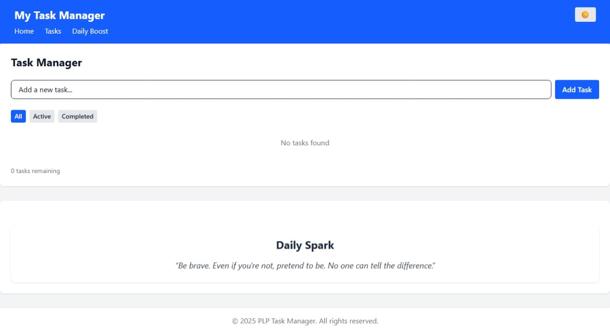

 # Task Manager — React + Vite + Tailwind

 **Live demo -  [https://plp-mern-stack-development.github.io/react-js-jsx-and-css-mastering-front-end-development-Jothphat21/](https://plp-mern-stack-development.github.io/react-js-jsx-and-css-mastering-front-end-development-Jothphat21/)

 A small React application built with Vite and Tailwind CSS that demonstrates component architecture, hooks, and a simple API integration.

 

 ## Contents
 - Project setup and requirements
 - Scripts: development, build, preview, lint
 - How to run the project locally (Windows / PowerShell commands)
 - Troubleshooting common errors (including network 500s)
 - Notes about the repository structure

 ---

 ## Requirements
 - Node.js 18+ (LTS recommended)
 - npm 9+ (installed with Node) or yarn
 - Git (to clone the repo)
 - Modern browser (Chrome/Edge/Firefox)

 ## Quick start (Windows / PowerShell)
 1. Open PowerShell in the project root (the folder that contains `package.json`).
 2. Install dependencies:

 ```powershell
 npm install
 ```

 3. Start the development server:

 ```powershell
 npm run dev
 ```

 4. Open the app in your browser. Vite will print a local URL such as `http://localhost:5173`.

 ## Available scripts
 - `npm run dev` — start the Vite dev server
 - `npm run build` — build the production bundle
 - `npm run preview` — locally preview the production build
 - `npm run lint` — run ESLint across the project

 ## How the app fetches data
 The example API page (`src/pages/ApiData.jsx`) fetches posts from `https://api.adviceslip.com/advice`. The fetch logic has been hardened to check `response.ok` and display HTTP status codes and messages when errors occur. This means if you see a 500 error the UI will now show a clear message like:

 > Request failed with status 500 Internal Server Error

 ### Debugging a 500 response
 1. Open DevTools (F12) → Network → reload the page and find the failing request.
 2. Inspect the Response tab for the server error message or stack trace.
 3. Reproduce the request from PowerShell using curl:

 ```powershell
 curl -i "https://api.adviceslip.com/advice"
 ```

 4. If the failing URL is a local API (for example `/api/...` proxied to a backend), check your backend logs for exceptions and verify environment variables and database connections.

 ## Add a retry or fallback
 If the API is unreliable you can:
 - Show a Retry button in the UI to re-run the fetch.
 - Show cached or mocked data while the API is down.
 - Implement exponential backoff retries for transient server errors.

 ## Project structure (key files)
 ```
 src/
    App.jsx               # Main app
    main.jsx              # Vite entry
    components/           # Reusable components (Navbar, Card, Footer, etc.)
    pages/
       ApiData.jsx         # Page that fetches posts and displays errors
    context/              # Theme context
 public/
    Task Manager Home.jpeg  # Screenshot used above
 package.json            # Scripts and dependencies
 vite.config.js
 ```

 ## Notes and common fixes
 - JSX fragment errors: If you see "JSX fragment has no corresponding closing tag" make sure any `<>` has a matching `</>` or wrap content in a single parent element.
 - Import errors: Ensure components are exported with `export default` and import paths are correct (case-sensitive on some systems).
 - Lint warnings: Remove unused imports (for example `useState`) or use them.

 ## Contributing
 1. Create a branch for your feature: `git checkout -b feat/my-feature`
 2. Make changes and run the dev server to test.
 3. Commit and push, then open a pull request.

 ## Contact / Help
 If you want me to:
 - Add a Retry button and fallback mock data to `ApiData.jsx`, I can implement that.
 - Generate curl/Postman commands for a specific failing URL, paste the URL and any headers and I'll produce them.

 ---

 
